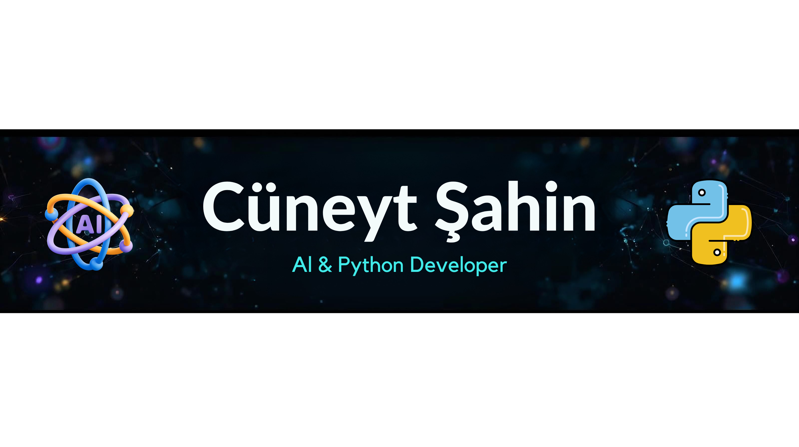

  <!--Banner-->

  

  <!--About Me-->

  <table>
    <tr>
      <td valign="top" width="62%">

  ### 🙋‍♂️ Aʙᴏᴜᴛ Mᴇ

  I am a 3rd-year **Computer Engineering** student with a deep passion for **Artificial Intelligence** and **Machine Learning**. My core focus is transforming raw, complex data into intelligent, predictive systems and building end-to-end AI solutions.

  - 🧠 **My Focus:** Architecting robust ML models, handling complex data imbalances (SMOTE), and deploying predictive algorithms like XGBoost and Isolation Forest.
  - 💼 **Experience:** Building AI-driven anomaly detection systems, benchmarking machine learning models, and developing custom Python data pipelines.
  - 🌱 **Currently exploring:** Advanced Deep Learning architectures and Computer Vision techniques.
  - 💬 **Ask me about:** Machine Learning pipelines, Data Science (Pandas/NumPy), LLM integration, and Python.
  - 📫 **Reach me at:** **cuneytsahin.17.17@gmail.com**

      </td>
      <td valign="top" align="center" width="38%">
         
        
      </td>
    </tr>
  </table>

  <!--Profile Count Badge-->

  

    
  

  ---

  <!--Languages and Tools Section-->

  <h2 align="center">Tᴇᴄʜ sᴛᴀᴄᴋ & Lᴀᴛᴇsᴛ ʙʟᴏɢs</h2> 
  <picture>
    <source media="(prefers-color-scheme: dark)" srcset="./Skills_Animation_Dark.gif">
    <source media="(prefers-color-scheme: light)" srcset="./Skills_Animation_White.gif">
    
  </picture>
   

  ### ⚡ Current Learning

  - 🧠 Deepening my knowledge in **Machine Learning and AI**, specifically focusing on predictive modeling and local LLM integrations.
  - 🖥️ Exploring advanced **QML & Python** patterns for building seamless, cross-platform desktop applications.
  - ⚙️ Improving my skills in **Data Science** and **Web Automation** using tools like Pandas, Scikit-learn, and Playwright.

  <!--Contribution Graph-->
  
  

    
  

  ---

  <!--Dynamic Quote card updates everyday at 12 PM-->

  <h2 align="center">🌟 Tʜᴏᴜɢʜᴛ ᴏғ ᴛʜᴇ Dᴀʏ 🌟</h2>

  <!--STARTS_HERE_QUOTE_CARD-->

  

      
  

  <!--ENDS_HERE_QUOTE_CARD-->

  <!--Contact Section-->

  <h2 align="center">🤝 Cᴏɴɴᴇᴄᴛ Wɪᴛʜ Mᴇ 🤝 </h2>
  

  

  

  

  

  

   

  <!--Buy me a coffee-->

  

  
  

  <!--Footer-->

  

    
  

